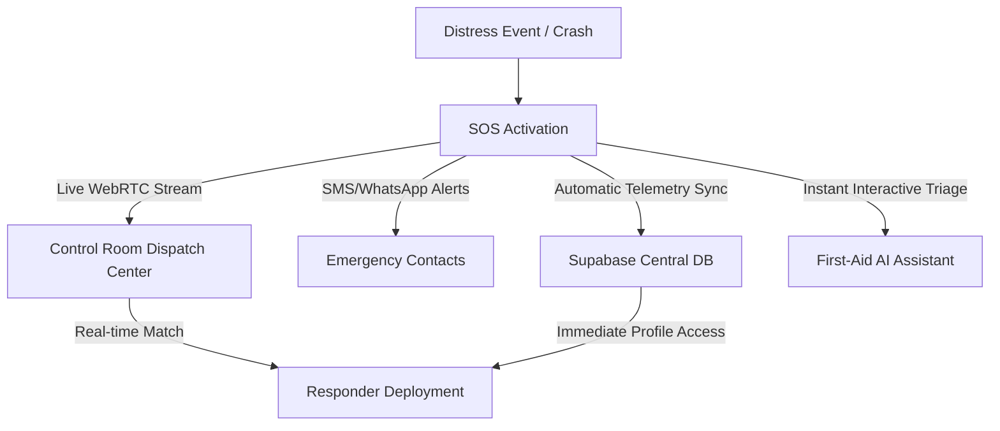

# 1. Project Synopsis — ROADSoS Emergency Intelligence Platform

> **Project Title:** ROADSoS: Real-Time Road Crash Detection, AI Triage, and Dispatch Intelligence Network  
> **Target Audience:** Public Citizens, First Responders, Emergency Control Room Operators  
> **Deployment Status:** Live Beta Sandbox (Vercel & Supabase Cloud)  

---

## 1. Executive Abstract

Every year, millions of lives are lost globally due to delayed emergency response times following road accidents. The crucial window immediately following a traumatic injury—known as the **Golden Hour**—is often squandered due to:
1. Inaccurate or delayed location sharing by panicking victims or bystanders.
2. Complete lack of responder visibility into the victim's critical medical history (blood group, severe allergies, pre-existing conditions).
3. Ineffective dispatcher routing and responder tracking.
4. Absence of instant, automated first-aid advice while emergency services are in transit.

**ROADSoS** is a comprehensive, state-of-the-art, emergency-response platform designed to completely digitize and streamline the crash response pipeline. By combining **Next.js 15 App Router**, **Supabase Real-Time CDC**, **WebRTC live distress feeds**, **Automotive Car Mode**, and **Generative AI Triage**, ROADSoS bridges the critical communication gap between citizens in distress and the emergency services dispatch centers.

---

## 2. The Problem Statement

Traditional emergency services heavily rely on legacy voice call structures (e.g., dialling 112/108/100). This system is fundamentally limited by:
- **Location Ambiguity:** Victims in unfamiliar areas cannot convey their coordinates, leading to routing delays.
- **Silent Distress Limits:** In severe crash scenarios, victims may be physically unable to speak, making audio-only calls useless.
- **Information Asymmetry:** Responders arrive at the scene blind, unaware of the victim's blood group, pre-existing medical conditions, or drug allergies.
- **Resource Bottlenecks:** Control rooms lack real-time dashboard tracking, resulting in suboptimal allocation of nearby response vehicles.

---

## 3. The ROADSoS Solution & Key Differentiators

ROADSoS transforms the emergency pipeline into an active, intelligent, real-time cooperative workflow.

### 3.1 Key Differentiators
1. **Interactive Countdowns & Multi-Trigger SOS:** Minimizes false alarms using a robust 3-second hold-down countdown, triggering via a clean visual touch button, accelerometer-based shake sensors, hardware key combinations (triple-pressing volume keys), or hands-free voice phrases.
2. **WebRTC Distress Streams:** Enables the victim’s device to act as an immediate audio/video broadcast node, creating an encrypted WebRTC stream that allows the dispatch center to see and hear the situation live without any extra app installations.
3. **Automotive "Car Mode" Deck:** Automatically detects landscape aspect ratios or standard CarPlay/Android Auto agent headers, adjusting the dashboard into a highly legible, dark-themed, tactile-focused console for hands-free vehicle safety.
4. **Supabase Real-time Radar:** The control room operates as a high-density, real-time hub, utilizing Postgres Change Data Capture (CDC) to receive incident telemetry, battery levels, network strength, and coordinates without manual page reloads.
5. **AI First-Aid Triage:** Incorporates LLM-backed intelligence (Gemini / Claude APIs) configured with clinical safety guidelines to deliver instantaneous, voice-enabled first-aid instructions tailored to the specific accident type.

---

## 4. Production Technology Stack

| Layer | Technology | Role & Justification |
| :--- | :--- | :--- |
| **Core Framework** | Next.js 15 (App Router) | High-performance React framework. Leverages server rendering, edge routes, and strict layout caching. |
| **User Interface** | React 19 & Framer Motion | High-fidelity fluid micro-animations, real-time rendering, and responsive bento-grids. |
| **Styling Engine** | Tailwind CSS v4 | CSS-first configuration and atomic layout optimizations for mobile and auto screens. |
| **State Management** | Zustand | Ultra-lightweight reactive client-side store managing SOS status, GPS locks, and telemetry. |
| **Database & Realtime**| Supabase (PostgreSQL) | Primary database storing schemas, custom triggers, spatial indexes (PostGIS), and Realtime Postgres CDC. |
| **Auth & Security** | NextAuth.js v5 (Auth.js) | Enterprise-grade OAuth framework securing app routes, operator consoles, and session handling. |
| **External Integration**| Twilio & Google Maps APIs | Twilio handles SMS/WhatsApp dispatch to emergency contacts. Maps API powers geocoding and live routing overlays. |
| **Live Media** | Simple-Peer (WebRTC) | Zero-dependency WebRTC wrapper executing direct, low-latency browser-to-browser audio/video streams. |
| **Triage Intelligence**| Google Gemini / Claude APIs | Powers the smart first-aid conversational agent, loaded with clinical safety guidelines. |

---

## 5. Architectural Modules

To maintain high maintainability and security, ROADSoS is partitioned into four major modules:

1. **Citizen Portal (Universal PWA):**
   - High-contrast touch panels.
   - GPS telemetry tracking and battery state monitoring.
   - Medical passport setup (allergies, pre-existing conditions, blood group).
   - Emergency contacts management.

2. **Automotive Deck (Car Mode Console):**
   - Landscape console optimization.
   - High-contrast, large-button visual elements.
   - Hands-free voice triggers ("Hey Emergency").
   - Integrated shortcut dials.

3. **Emergency Dispatch Center (Control Room Console):**
   - Live Incident Radar Board.
   - WebRTC media handshake receiver.
   - Real-time matching matrix mapping nearby available responders.
   - Single-click responder deployment.

4. **Secure Notification & Messaging Broker:**
   - Multi-channel notification pipeline (SMS, WhatsApp, Push API, Email).
   - Secure server API routes protected by strict Auth.js credentials middleware.
   - Database security managed by Row Level Security (RLS) tables.
