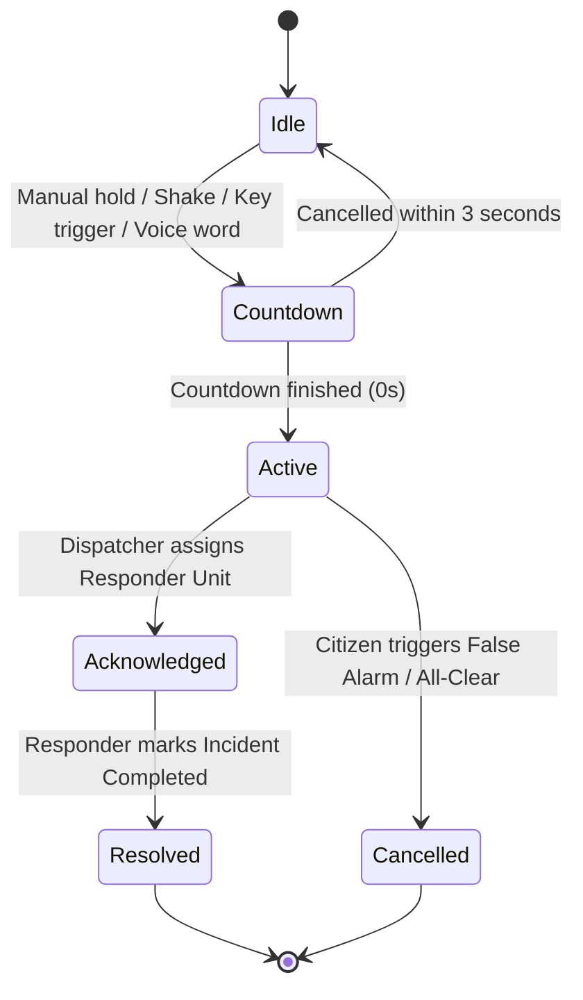
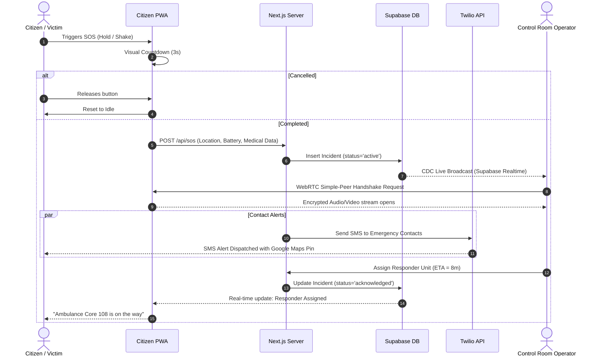

# 2. Software Requirements Specification (SRS) Document

> **Standard:** IEEE Std 830-1998  
> **System:** ROADSoS Road-Emergency Platform  
> **Version:** 1.0.0 — Production Specification  

---

## 1. Introduction

### 1.1 Purpose
This document provides a comprehensive Software Requirements Specification (SRS) for the ROADSoS Platform. It details the functional, non-functional, security, and interface requirements for the system, ensuring alignment between stakeholders, developers, and evaluators.

### 1.2 Scope
ROADSoS is a responsive, web-based Progressive Web Application (PWA) that acts as an emergency response accelerator. It integrates client-side geolocative tracking, hardware event sensors, low-latency audio/video communication via WebRTC, and Generative AI to expedite the deployment of medical/first-responder units during road traffic accidents.

### 1.3 Definitions, Acronyms, and Abbreviations
- **CDC:** Change Data Capture (Real-time database sync listener)
- **RLS:** Row Level Security (Database row-access restriction policies)
- **SOS:** Save Our Souls (Emergency distress broadcast)
- **WebRTC:** Web Real-Time Communication (Peer-to-peer browser video/audio streaming)
- **PWA:** Progressive Web Application (Web app that behaves like a native mobile app)
- **JWT:** JSON Web Token (Session authentication token)
- **ETA:** Estimated Time of Arrival

---

## 2. Overall Description

### 2.1 Product Perspective
ROADSoS consists of a public-facing citizen interface, a voice-enabled auto dashboard, an administrative dispatch console, and a relational database managed under secure Row Level Security (RLS) policies. The application runs natively in modern web viewports, optimized for mobile browsers, and is hosted on Vercel with a Supabase cloud database backend.

### 2.2 Product Functions
The high-level capabilities of the platform include:
1. Citizen profiles maintaining demographic information and critical medical histories.
2. Emergency contacts pipeline integrated with instant SMS/WhatsApp alerts.
3. Multi-modal SOS triggers (Manual hold, shake gestures, volume key triple-clicks, voice phrase).
4. Continuous real-time GPS coordinate logging and device state synchronization (battery, network speed).
5. Dynamic CarPlay/Android Auto visual layout adaptation (Car Mode).
6. Administrative "Control Room" radar board with direct WebRTC distress streams.
7. Real-time responder dispatch and vehicle arrival countdown tracking.
8. Interactive First Aid AI conversational assistant.
9. Crowdsourced public accident map pins with upvoting and severity classification.

### 2.3 User Classes and Characteristics
- **Citizen / Victim:** Requires an extremely simplified, accessible, high-contrast user interface with large target buttons that operate reliably in low-network, stressful situations.
- **Dispatch Operator (Admin):** Requires a desktop-oriented, high-density telemetry dashboard showing active streams, responder availability lists, and routing tools.
- **Emergency Responder:** Field units (Ambulance, Fire, Police) needing simple ETA updates, location mapping, and status transition tools.

---

## 3. Functional Requirements Catalog

### 3.1 Citizen Panel & Profile Module
* **REQ-1.1 (Medical Passport):** The system must allow users to input date of birth, blood group, allergies, pre-existing conditions, and home address.
* **REQ-1.2 (Emergency Contacts):** The system must support creating multiple emergency contacts with parameters specifying whether notifications are dispatched via SMS, WhatsApp, and/or Email.
* **REQ-1.3 (Onboarding Gate):** The system must force new users to complete their medical passport and input at least one emergency contact before full app usage, providing a skip function strictly for developer evaluation.

### 3.2 SOS Trigger & Telemetry Module
* **REQ-2.1 (Manual SOS Button):** The manual SOS trigger must require a continuous 3-second hold-down duration to avoid false alarms. A full-screen visual countdown circle must show feedback.
* **REQ-2.2 (Accelerometer Shake Trigger):** The application must listen to device motion, allowing users to shake the phone (threshold: 4G) to trigger a countdown to SOS.
* **REQ-2.3 (Hardware Key Trigger):** The system must support triggering the SOS flow if the user triple-clicks standard volume keys within 1.5 seconds.
* **REQ-2.4 (Voice Activation):** The citizen app must support microphone-based wake-word matching ("Hey Emergency") to initiatehands-free distress procedures.
* **REQ-2.5 (Continuous Telemetry):** Once activated, the app must continuously transmit latitude, longitude, network connection type, and battery level back to the server every 5 seconds.

### 3.3 Dispatch Center (Control Room) Module
* **REQ-3.1 (Live Incident Radar):** The control room must display a real-time card list of all unresolved incidents using database CDC listeners (no manual polling allowed).
* **REQ-3.2 (WebRTC Distress Receiver):** The control room cards must automatically initiate a WebRTC signaling handshake to receive and play distress video/audio streams from the victim's device.
* **REQ-3.3 (Victim Telemetry Mapping):** The console must display the victim's critical medical attributes, battery status, exact coordinates, and address.
* **REQ-3.4 (Responder Match and Deploy):** Operators must be able to select from a real-time list of available nearby responder units, specify an ETA, and deploy them. Doing so changes the incident status to `acknowledged`.

### 3.4 Crowdsourced Map & AI Triage Module
* **REQ-4.1 (Crowdsourced Reports):** Authenticated users must be able to report road accidents on a public map, specifying description, photo URL, and severity level (minor, moderate, severe, fatal).
* **REQ-4.2 (AI First Aid Agent):** The AI assistant must offer step-by-step first aid guidelines based on clinical safety prompts, utilizing generative models with localized language translation.

---

## 4. System Behavioural Diagrams

### 4.1 State Transition Diagram (SOS Event Lifecycle)

### 4.2 System Sequence Diagram (Distress to Dispatch)

---

## 5. Non-Functional Requirements (NFR)

### 5.1 Performance & Latency
- **SOS API Response:** The `POST /api/sos` route must execute in less than 200ms under standard loads.
- **CDC Sync Latency:** Changes in incident table records must reflect in the control-room operator's dashboard within 500ms of database commitment.
- **WebRTC Latency:** Media stream transmission latency between citizen and operator must remain below 150ms.

### 5.2 Availability & Resilience
- **Offline Capability:** The Citizen PWA must function offline using service worker caching, offering basic local directories and pre-cached first-aid manuals.
- **Graceful Telemetry Degradation:** In low-bandwidth areas (Edge/2G), the WebRTC media stream must automatically fall back to pure audio telemetry or regular 10-second GPS coordinate pings.

### 5.3 Accessibility & Mobile Ergonomics
- **Color Contrast:** All citizen interface components must adhere to WCAG 2.1 Level AA standards.
- **Car Mode Touch Targets:** The Car Mode Automotive Deck buttons must have a minimum interactive size of 64px x 64px to ensure safe handling on vehicular mounts.
