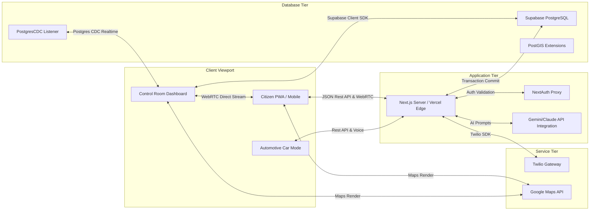
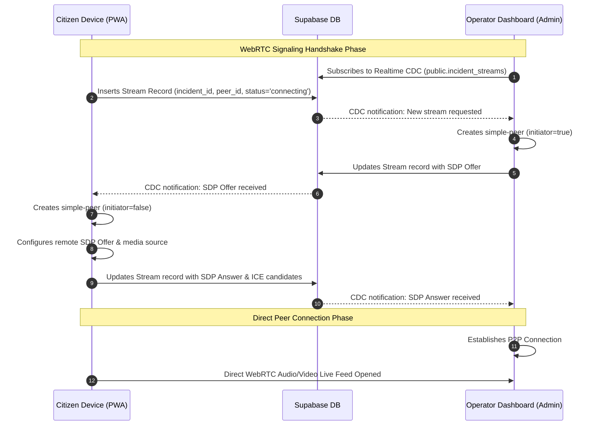

# 3. System Architecture & Design Document

> **Architecture Style:** Decoupled Client-Server / Serverless Edge  
> **Key Patterns:** Client-side State Machines, Postgres Realtime CDC, WebRTC Signaling Handshakes  
> **Target Framework:** Next.js 15+ App Router, React 19, Supabase  

---

## 1. High-Level System Architecture

ROADSoS uses a highly optimized, modern hybrid architecture that combines edge-computed API routes, client-side reactive state machines, and real-time database synchronizers.



- **Client Tier:** The frontend runs client-side React 19 code, styled with Tailwind CSS v4. It manages telemetry state, device gestures, and WebRTC streaming using simple-peer and Zustand stores.
- **Application Tier (Next.js App Router Server):** Runs as a serverless gateway. It validates authorization sessions (Auth.js v5), protects administrative endpoints, delegates LLM instructions, and interfaces with third-party providers (Twilio, Resend, VAPID).
- **Database & Realtime Broker Tier (Supabase):** Manages relational PostgreSQL tables, triggers automatic updates (e.g., syncing auth users into profiles), enforces row access boundaries via Row Level Security (RLS), and acts as a central Change Data Capture (CDC) broker that streams real-time database modifications directly to control-room dashboards.

---

## 2. Next.js App Router Route Map

ROADSoS utilizes Next.js App Router file-system routing conventions, segregating citizen screens, administrative interfaces, and serverless backend API functions.

```
roadsos/
├── app/
│   ├── layout.tsx         # Global provider wrapper (Session, i18next, Themes)
│   ├── page.tsx           # Mobile-first Citizen Dashboard / Car Mode gateway
│   ├── onboarding/        # First-time Medical Profile & Contact setup wizard
│   ├── settings/          # Profile editing and preference configuration
│   ├── map/               # Crowdsourced accident map viewer
│   ├── chat/              # First-aid AI triage chat portal
│   ├── first-aid/         # Caching-enabled first aid training guides
│   ├── directory/         # Interactive offline-capable dialer
│   ├── control-room/      # Restricted Emergency Dispatch operator console
│   └── api/
│       ├── auth/          # Auth.js handler routes (Google/Apple OAuth)
│       ├── profile/       # Profile management & contact editing API
│       ├── sos/           # SOS reporting, db insertion, and SMS alert trigger
│       │   ├── push/      # VAPID push notifications worker
│       │   └── all-clear/ # Incident resolution handler
│       └── ai/            # AI assistant pipeline for first aid
```

---

## 3. WebRTC Signaling and Streaming Flow

To capture immediate environmental context, ROADSoS uses WebRTC peer connections. Because WebRTC operates as a direct peer-to-peer browser connection, an initial exchange of signaling metadata—called Session Description Protocol (SDP) offers, answers, and ICE candidates—is required.

ROADSoS leverages the **Supabase Relational Database** as the signaling channel via the `incident_streams` table and real-time database subscriptions, eliminating the need for a separate WebSocket signaling server.



---

## 4. "Car Mode" Viewport and Device Adapter Logic

ROADSoS has an automated, responsive automotive UI deck designed to run directly on in-car display screens.

### 4.1 Car Mode Detection Matrix
The system evaluates the context to activate Car Mode:
1. **User Agent Audit:** Inspects `navigator.userAgent` for matching keywords (`carplay`, `androidauto`, `android auto`, `car-mode`).
2. **Dimension Constraints:** Detects typical landscape automotive display proportions (Viewport width $> 600\text{px}$ AND Viewport height $< 550\text{px}$).
3. **Query Indicator Override:** Accepts an explicit `?mode=car` URL query override parameter (crucial for review and preview dashboards).

```typescript
const checkCarMode = () => {
  const ua = navigator.userAgent.toLowerCase();
  const hasCarAgent =
    ua.includes('carplay') ||
    ua.includes('androidauto') ||
    ua.includes('android auto') ||
    ua.includes('car-mode');
  const searchParams = new URLSearchParams(window.location.search);
  const hasCarQuery = searchParams.get('mode') === 'car';
  
  // Landscape wide screen and small height: typical dashboard dimension
  const isCarSizing = window.innerWidth > 600 && window.innerHeight < 550;
  
  setIsCarMode(hasCarAgent || hasCarQuery || isCarSizing);
};
```

### 4.2 Styling & Tactile Considerations (Tailwind CSS v4)
When Car Mode is active:
- **Background Contrast:** The viewport transitions to `#000000` (deep pitch black) to eliminate in-vehicle glare.
- **Extreme Contrast Ratios:** Interactive elements switch to high-contrast red (`text-red-500`, `bg-red-950/15`) and amber to maintain daylight legibility.
- **Large Touch Targets:** Touch elements leverage large shapes (`rounded-3xl`, `rounded-2xl`) and touch dimensions matching CarPlay design criteria ($> 64\text{px}$).
- **Reduced Cognitive Load:** The home page grid is simplified from detailed lists to a 2-column dashboard: one giant SOS trigger button and three large, high-legibility shortcut icons (Emergency Map, Hands-Free Voice Assistant, Call Help).

---

## 5. Performance and Latency Optimization Design

To ensure optimal execution during high-stress scenarios, three specific performance guardrails are integrated into the architecture:

1. **State Partitioning with Zustand:** Application state is managed by localized client Zustand stores. The active SOS status, location coordinates, accuracy telemetry, and ongoing battery parameters bypass heavy React context re-renders, feeding directly into specific leaf components.
2. **Supabase Realtime Connection Pool:** The Control Room utilizes a persistent single WebSocket channel subscribing to `postgres_changes` across tables: `incidents`, `messages`, and `responders`. This reduces the browser connection count and optimizes mobile battery life.
3. **Service Worker Offline Caching:** Core assets, including global CSS, Next.js page bundles, first-aid static markdown manuals, and vector map files, are pre-cached. In absolute dead-zones, users can still access immediate first-aid instructions offline.
