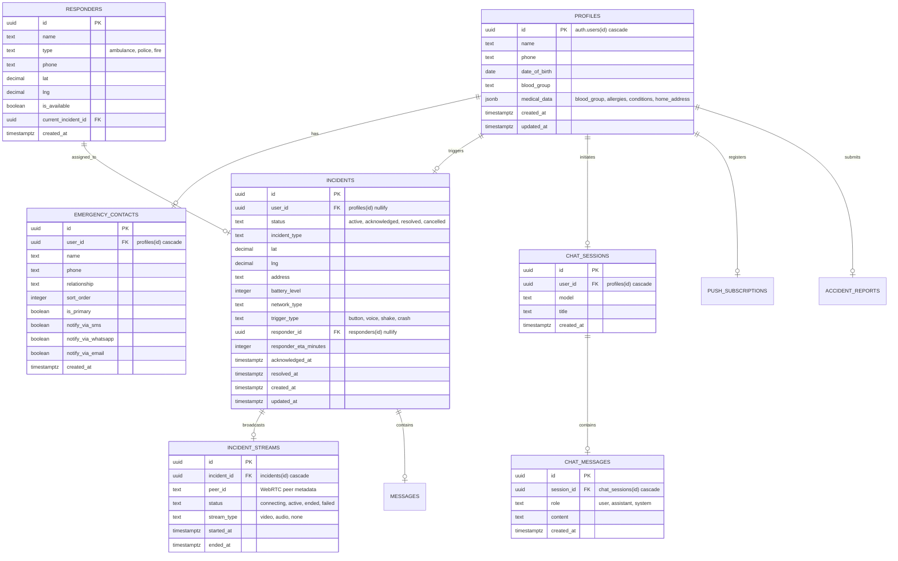

# 4. Database Schema & Security Design Guide

> **Database System:** PostgreSQL (Supabase Managed Cloud)  
> **Key Extensions:** `uuid-ossp`, `postgis`  
> **Security Model:** Enforced Row Level Security (RLS)  

---

## 1. Conceptual Entity-Relationship Diagram (ERD)

The relational architecture of ROADSoS is designed to guarantee referential integrity and support real-time Change Data Capture (CDC). Below is the conceptual entity-relationship blueprint:



---

## 2. Table Catalog and Data Dictionary

### 2.1 Table: `public.profiles`
Stores primary citizen identities and demographic attributes.
- **`id`** (`UUID`, Primary Key): References `auth.users(id)` with cascading deletion.
- **`name`** (`TEXT`): User's full display name.
- **`phone`** (`TEXT`): Contact phone number.
- **`date_of_birth`** (`DATE`): Date of birth.
- **`blood_group`** (`TEXT`): User's blood group (`A+`, `A-`, `B+`, `B-`, `O+`, `O-`, `AB+`, `AB-`, `Unknown`).
- **`medical_data`** (`JSONB`): Key-value store containing clinical attributes like `allergies[]`, `medical_conditions[]`, and `home_address`.
- **`created_at` / `updated_at`** (`TIMESTAMPTZ`): Automatic audit timestamps.

### 2.2 Table: `public.emergency_contacts`
Maintains a citizen's designated first-aid and emergency notification contacts.
- **`id`** (`UUID`, Primary Key): Auto-generated unique identifier.
- **`user_id`** (`UUID`, Foreign Key): References `public.profiles(id)` with cascading deletion.
- **`name`** (`TEXT`): Name of the emergency contact.
- **`phone`** (`TEXT`): Phone number of the contact.
- **`relationship`** (`TEXT`): User relationship (e.g., Parent, Spouse, Doctor).
- **`sort_order`** (`INTEGER`): Display priority weight.
- **`is_primary`** (`BOOLEAN`): Main contact flag.
- **`notify_via_sms` / `notify_via_whatsapp` / `notify_via_email`** (`BOOLEAN`): Opt-in notification channels.

### 2.3 Table: `public.incidents`
Tracks active SOS calls and emergency response events.
- **`id`** (`UUID`, Primary Key): Unique SOS event identifier.
- **`user_id`** (`UUID`, Foreign Key): References `public.profiles(id)` (set to NULL if the user profile is deleted).
- **`status`** (`TEXT`): Current event lifecycle stage (`active`, `acknowledged`, `resolved`, `cancelled`, `false_alarm`).
- **`incident_type`** (`TEXT`): Category of disaster (`road_crash`, `medical_emergency`, `pedestrian_hit`, `vehicle_fire`, `unknown`).
- **`lat` / `lng`** (`DECIMAL`): High-precision coordinate coordinates.
- **`address`** (`TEXT`): Geocoded location descriptor.
- **`battery_level`** (`INTEGER`): Battery charge status of the victim's device (crucial for energy conservation triage).
- **`network_type`** (`TEXT`): Internet speed category (`wifi`, `4g`, `3g`, `2g`).
- **`trigger_type`** (`TEXT`): Activation origin (`button`, `voice`, `shake`, `crash`).
- **`responder_id`** (`UUID`, Foreign Key): References deployed `public.responders(id)`.
- **`responder_eta_minutes`** (`INTEGER`): Deployed unit countdown ETA.

---

## 3. Row Level Security (RLS) Policy Specification

Supabase mandates Row Level Security (RLS) to enforce data boundaries. The active ROADSoS project implements a secure configuration:

| Table | Policy Name | Command | Target Role | Enforced Condition |
| :--- | :--- | :--- | :--- | :--- |
| **profiles** | "Users read own profile" | `SELECT` | `authenticated` | `(SELECT auth.uid()) = id` |
| **profiles** | "Users insert own profile"| `INSERT` | `authenticated` | `(SELECT auth.uid()) = id` |
| **profiles** | "Users update own profile"| `UPDATE` | `authenticated` | `(SELECT auth.uid()) = id` |
| **emergency_contacts** | "Users manage own contacts" | `ALL` | `authenticated` | `(SELECT auth.uid()) = user_id` |
| **incidents** | "Users see own incidents" | `SELECT` | `authenticated` | `(SELECT auth.uid()) = user_id OR show_on_public_map = TRUE` |
| **incidents** | "Users create own incidents"| `INSERT` | `authenticated` | `(SELECT auth.uid()) = user_id` |
| **incidents** | "Users update own incidents"| `UPDATE` | `authenticated` | `(SELECT auth.uid()) = user_id` |
| **chat_sessions** | "Users manage own chat" | `ALL` | `authenticated` | `(SELECT auth.uid()) = user_id` |
| **chat_messages** | "Users manage own messages" | `ALL` | `authenticated` | `session_id IN (SELECT id FROM chat_sessions WHERE user_id = auth.uid())` |
| **accident_reports** | "Anyone can read accident reports"| `SELECT` | `public` | `TRUE` |
| **accident_reports** | "Auth users report accidents"| `INSERT` | `authenticated` | `(SELECT auth.uid()) IS NOT NULL` |

---

## 4. Trigger Automations & Triggers

To streamline background processing and minimize API-side logic, ROADSoS uses native PL/pgSQL database automation triggers.

### 4.1 Automated Timestamp Auditor (`handle_updated_at`)
Executes before any update operation on `profiles` or `incidents` tables, ensuring the `updated_at` field maintains high-fidelity timing logs.

```sql
CREATE OR REPLACE FUNCTION public.handle_updated_at()
RETURNS TRIGGER AS $$
BEGIN
  NEW.updated_at = NOW();
  RETURN NEW;
END;
$$ LANGUAGE plpgsql;

CREATE TRIGGER profiles_updated_at BEFORE UPDATE ON public.profiles
  FOR EACH ROW EXECUTE FUNCTION public.handle_updated_at();
```

### 4.2 Auth Profile Synchronization Trigger (`handle_new_user`)
Subscribes directly to the `auth.users` schema (managed by Supabase Auth). When a user successfully authenticates via Google/Apple OAuth or OTP signup, a trigger fires to automatically insert their raw metadata into `public.profiles`.

```sql
CREATE OR REPLACE FUNCTION public.handle_new_user()
RETURNS TRIGGER AS $$
BEGIN
  INSERT INTO public.profiles (id, name, phone, date_of_birth, blood_group, medical_data)
  VALUES (
    NEW.id,
    COALESCE(NEW.raw_user_meta_data->>'full_name', NEW.raw_user_meta_data->>'name', 'User'),
    NEW.phone,
    NULL,
    'Unknown',
    '{}'::jsonb
  );
  RETURN NEW;
END;
$$ LANGUAGE plpgsql SECURITY DEFINER;

CREATE TRIGGER on_auth_user_created
  AFTER INSERT ON auth.users
  FOR EACH ROW EXECUTE FUNCTION public.handle_new_user();
```
